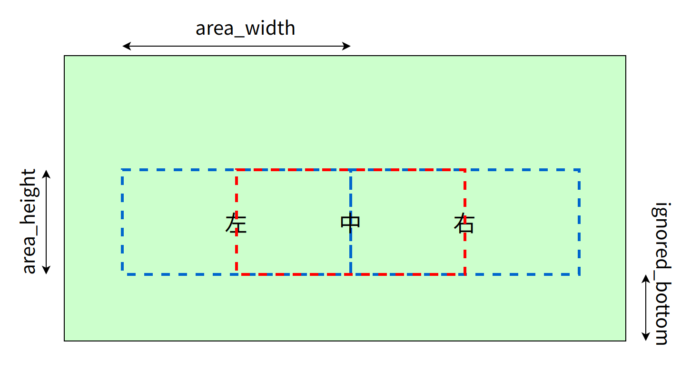
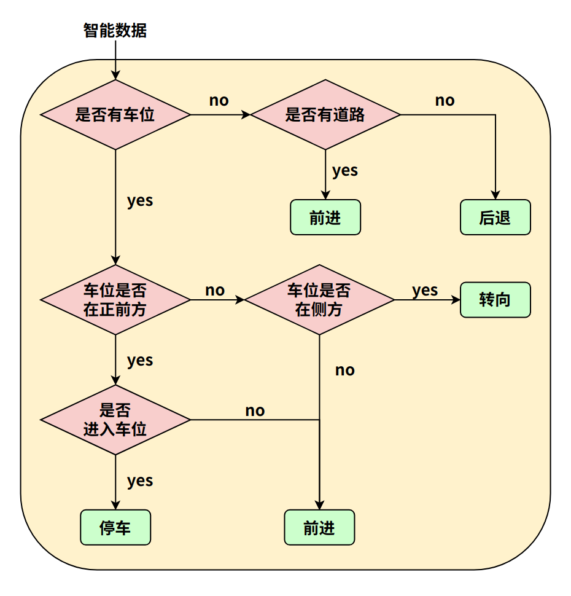
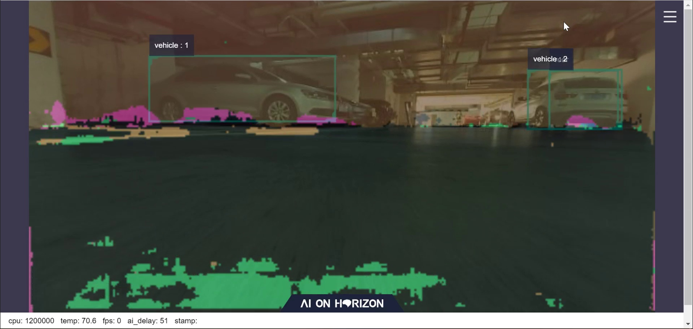

# 功能介绍

parking_search package功能为通过车位检测算法指导机器人运动到停车位。

订阅智能结果ai_msgs，运行策略，确定车位位置和机器人控制策略。

通过发布消息直接控制机器人旋转和平移运动。

## 控制策略

将视野场景区域分为“左”、“中”、“右”三个区域。计算每个区域内停车区域和行车区域的IOU，根据阈值判断对应区域类型，判断前进方向。若二者区域皆低于阈值，则采用后退重新计算判断。

| 视野区域 | 左 | 中 | 右 |
| - | - | - | - |
| 停车区域 IOU | 0.6 | 0.7 | 0.6 |
| 行车区域 IOU | 0.8 | 0.9 | 0.8 |

<br/>

## 决策优先级

停车区域 > 行车区域 > 其他区域
       
中间区域 > 右边区域 > 左边区域

## 算法流程图

<br/>

# 编译

## 依赖库

ros package：

\- ai_msgs

ai_msgs为自定义的消息格式，用于算法模型推理后，发布推理结果，ai_msgs pkg定义在hobot_msgs中。

## 开发环境

\- 编程语言: C/C++

\- 开发平台: X3/X86

\- 系统版本：Ubuntu 20.0.4

\- 编译工具链:Linux GCC 9.3.0/Linaro GCC 9.3.0

## **编译**

 支持在X3 Ubuntu系统上编译和在PC上使用docker交叉编译两种方式。

### **Ubuntu板端编译**

1. 编译环境确认 
   - 板端已安装X3 Ubuntu系统。
   - 当前编译终端已设置TogetherROS环境变量：`source PATH/setup.bash`。其中PATH为TogetherROS的安装路径。
   - 已安装ROS2编译工具colcon，安装命令：`pip install -U colcon-common-extensions`
2. 编译

编译命令：`colcon build --packages-select parking_search`

### Docker交叉编译

1. 编译环境确认

   - 在docker中编译，并且docker中已经安装好TogetherROS。docker安装、交叉编译说明、TogetherROS编译和部署说明详见机器人开发平台robot_dev_config repo中的README.md。

2. 编译

   - 编译命令：

```shell
export TARGET_ARCH=aarch64
export TARGET_TRIPLE=aarch64-linux-gnu
export CROSS_COMPILE=/usr/bin/$TARGET_TRIPLE-

colcon build --packages-select parking_search \
   --merge-install \
   --cmake-force-configure \
   --cmake-args \
   --no-warn-unused-cli \
   -DCMAKE_TOOLCHAIN_FILE=`pwd`/robot_dev_config/aarch64_toolchainfile.cmake
```

## 注意事项

# 使用介绍

## 依赖

- mipi_cam package：发布图片msg
- hobot_codec package：jpeg图片编码&发布
- parking_perception package：发布车位信息感知结果msg
- websocket package：渲染图片和ai感知msg

## 参数

| 参数名                    | 类型        | 解释                                           | 是否必须 | 支持的配置                                                                                              | 默认值                        | 是否支持运行时动态配置 |
| ------------------------- | ----------- | ---------------------------------------------- | -------- | ------------------------------------------------------------------------------------------------------- | ----------------------------- | ---------------------- |
| area_height | int         | 每个检测区域高度 | 否       | 0-(160-ingored_bottom)                                                                                                  | 40                           | 否                     |
| area_width   | int         | 每个检测区域宽度                             | 否       | 0-160                                                                               | 120                             | 否                     |
| ingored_bottom   | int         | 忽略底部高度                             | 否       | 0-(160-area_height)                                                                               | 40                             | 否                     |
| mid_parking_iou                 | float       | 停车区域检测IOU阈值                       | 否       | 0-1                                                                                                  | 0.7                           |否                     | 
| sides_parking_iou                 | float       | 行车区域检测IOU阈值                       | 否       | 0-1                                                                                                  | 0.6                           | 否                     |
| mid_path_iou                 | float       | 停车区域检测IOU阈值                       | 否       | 0-1                                                                                                  | 0.9                           | 否                     |
| sides_path_iou                 | float       | 行车区域检测IOU阈值                       | 否       | 0-1                                                                                                  | 0.8                           | 否                     |
| arrived_count | int         | 判断进入车位的条件计数 | 否       | 大于0                                                                                                  | 400                           | 否                     |
| move_step                 | float       | 平移运动的步长，单位米。                       | 否       | 无限制                                                                                                  | 0.1                           | 是                     |
| rotate_step               | float       | 旋转运动的步长，单位弧度。                     | 否       | 无限制                                                                                                  | 0.1                           | 是                     |
| twist_pub_topic_name      | std::string | 发布Twist类型的运动控制消息的topic名           | 否       | 根据实际部署环境配置。一般机器人订阅的topic为/cmd_vel，ROS2 turtlesim示例订阅的topic为turtle1/cmd_vel。 | /cmd_vel                      | 否                     |
| ai_msg_sub_topic_name     | std::string | 订阅包含停车区域结果的AI消息的topic名          | 否       | 根据实际部署环境配置                                                                                    | /ai_msg_parking_perception | 否                     |

## 运行

编译成功后，将生成的install路径拷贝到地平线X3开发板上（如果是在X3上编译，忽略拷贝步骤），并执行如下命令运行：

### **Ubuntu**

```shell
export COLCON_CURRENT_PREFIX=./install
source ./install/setup.bash
# config中为示例使用的模型，根据实际安装路径进行拷贝
# 如果是板端编译（无--merge-install编译选项），拷贝命令为cp -r install/PKG_NAME/lib/PKG_NAME/config/ .，其中PKG_NAME为具体的package名。
cp -r install/lib/parking_perception/config/ .

# mipi摄像头输入
export CAM_TYPE=mipi

ros2 launch parking_search hobot_parking_search.launch.py
```

### **Linux**

```shell
export ROS_LOG_DIR=/userdata/
export LD_LIBRARY_PATH=${LD_LIBRARY_PATH}:./install/lib/

# config中为示例使用的模型，根据实际安装路径进行拷贝
cp -r install/lib/parking_perception/config/ .

# 启动图片发布pkg
./install/lib/mipi_cam/mipi_cam --ros-args -p out_format:=nv12 -p image_width:=640 -p image_height:=320 -p io_method:=shared_mem --log-level error &
# 启动jpeg图片编码&发布pkg
./install/lib/hobot_codec/hobot_codec_republish --ros-args -p channel:=1 -p in_mode:=shared_mem -p in_format:=nv12 -p out_mode:=ros -p out_format:=jpeg -p sub_topic:=/hbmem_img -p pub_topic:=/image_jpeg --ros-args --log-level error &
# 启动停车区域检测pkg
./install/lib/parking_perception/parking_perception --ros-args --log-level error &
# 启动web展示pkg
./install/lib/websocket/websocket --ros-args -p image_topic:=/image_jpeg -p image_type:=mjpeg -p smart_topic:=/ai_msg_parking_perception --log-level error &

# 启动停车区域寻找pkg
./install/lib/parking_search/parking_search
```

## 注意事项

1. 板端使用launch启动，需要安装依赖，安装命令：`pip3 install lark-parser`。设备上只需要配置一次，断电重启不需要重新配置。
2. 启动小车运动pkg，需要配置驱动：`cp install/lib/xrrobot/config/58-xrdev.rules /etc/udev/rules.d/`，拷贝后重启X3开发板。设备上只需要配置一次，断电重启不需要重新配置。
3. 第一次运行web展示需要启动webserver服务，运行方法为:

- cd 到websocket的部署路径下：`cd install/lib/websocket/webservice/`（如果是板端编译（无--merge-install编译选项）执行命令为`cd install/websocket/lib/websocket/webservice`）
- 启动nginx：`chmod +x ./sbin/nginx && ./sbin/nginx -p .`
- 设备重启需要重新配置。

# 结果分析

## X3结果展示

1. 小车在行车区域搜寻前进时log信息

```
[parking_search-4] [WARN] [1661942399.306904646] [ParkingSearchEngine]: do move, direction: 0, step: 0.100000
[parking_search-4] [WARN] [1661942399.343490021] [ParkingSearchEngine]: do move, direction: 0, step: 0.100000
[parking_perception-3] [WARN] [1661942399.347396979] [parking_perception]: input fps: 29.97, out fps: 29.67
[parking_search-4] [WARN] [1661942399.410602188] [ParkingSearchEngine]: do move, direction: 0, step: 0.100000
[parking_search-4] [WARN] [1661942399.449585563] [ParkingSearchEngine]: do move, direction: 0, step: 0.100000
```

2. 小车发现车位后转向时log信息

```
[parking_search-4] [WARN] [1662539779.408424498] [ParkingSearchEngine]: do rotate, direction: 2, step: 0.100000
[parking_search-4] [WARN] [1662539779.442805415] [ParkingSearchEngine]: do rotate, direction: 2, step: 0.100000
[parking_search-4] [WARN] [1662539779.483669831] [ParkingSearchEngine]: do rotate, direction: 2, step: 0.100000
[parking_search-4] [WARN] [1662539779.522690915] [ParkingSearchEngine]: do rotate, direction: 2, step: 0.100000
[parking_search-4] [WARN] [1662539779.563660873] [ParkingSearchEngine]: do rotate, direction: 2, step: 0.100000
[parking_perception-3] [WARN] [1662539779.595755290] [parking_perception]: input fps: 29.87, out fps: 29.63
[parking_search-4] [WARN] [1662539779.604272498] [ParkingSearchEngine]: do rotate, direction: 2, step: 0.100000
```

3. 小车确定车位后前进并最终停止时log信息

```
[parking_search-4] [WARN] [1662539796.196264298] [ParkingSearchEngine]: do move, direction: 0, step: 0.100000
[parking_search-4] [WARN] [1662539796.227805589] [ParkingSearchEngine]: Find Target, current count: 398, target count: 400
[parking_search-4] [WARN] [1662539796.267424798] [ParkingSearchEngine]: do move, direction: 0, step: 0.100000
[parking_search-4] [WARN] [1662539796.317332964] [ParkingSearchEngine]: Find Target, current count: 399, target count: 400
[parking_search-4] [WARN] [1662539796.346787673] [ParkingSearchEngine]: do move, direction: 0, step: 0.100000
[parking_search-4] [WARN] [1662539796.386203756] [ParkingSearchEngine]: Find Target, current count: 400, target count: 400
[parking_perception-3] [WARN] [1662539796.428427089] [ParkingSearchEngine]: input fps: 29.90, out fps: 29.74
[parking_search-4] [WARN] [1662539796.465178589] [ParkingSearchEngine]: Parking Area Arrived !!!
[parking_search-4] [WARN] [1662539796.506218048] [ParkingSearchEngine]: Parking Area Arrived !!!
[parking_search-4] [WARN] [1662539796.547036881] [ParkingSearchEngine]: Parking Area Arrived !!!

```

## web效果展示

在实践停车场景下检测效果

<br/>


# 常见问题

Q1: 使用不同分辨率相机输入时，app功能达不到预期

A1: 目前对超过640x320分辨率的数据，算法只处理640x320分辨率内的智能结果，因此需要修改区域大小的参数(area_height, area_width, ingored_bottom)适配不同分辨率。建议采用默认输入分辨率。